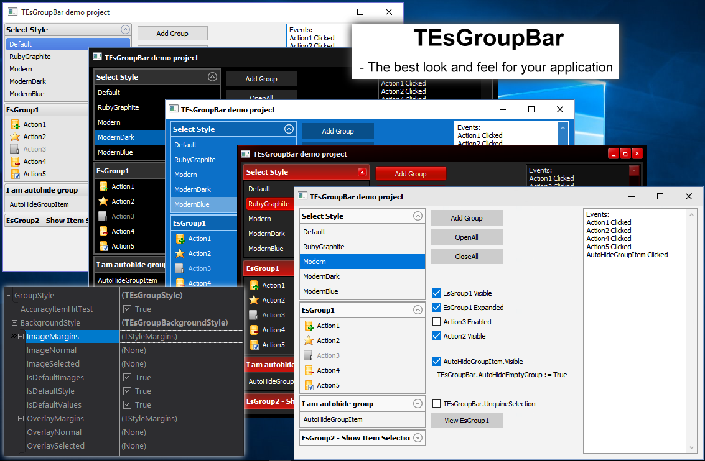

# TEsGroupBar

Version 1.0
Support Delphi 2010 - Delphi Berlin (DX10.1)
Now: C++Builder support!

License: 
Creative Commons Attribution-NonCommercial-ShareAlike 4.0 International Public License.
You can purchase a license for commercial use.

[ENG]
TEsGroupBar - This sidebar is similar to the panel conductor Windows XP, and allows the set any skin (nine-path png images), in addition there is a support of a few modes.

The component is OpenSource, free for noncommercial use, must specify in the About or elsewhere about using this component, preferably with reference to the repository.

You can purchase a license for commercial use, $30, writing to Enter256@yandex.ru.

After purchasing a license, you also get a year of free updates and technical support.

Сan add need features or custom styles for you.

[RUS]
TEsGroupBar - Это боковая панель, подобная панели проводника в XP, позволяющая установку любого скина.
Компонент имеет множество настроек, и может быть настроен на любой вкус.

Компонент бесплатен для некоммерческого использования, необходимо указать в About или в другом месте 
о использовании данного компонента, желательно с ссылкой на данный репозиторий.
Вы можете приобрести лицензию для коммерческого использования, стоимостью $30 (для россиян 1500р), написав на errorsoft@mail.ru или Enter256@yandex.ru.
Приобретая лицензию, вы также получаете год бесплатных обновлений и техническую поддержку.

Возможно добавление необходимого вам функционала.
Возможно изготовление стилей на заказ.
